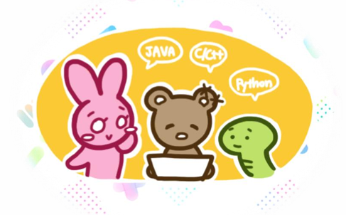
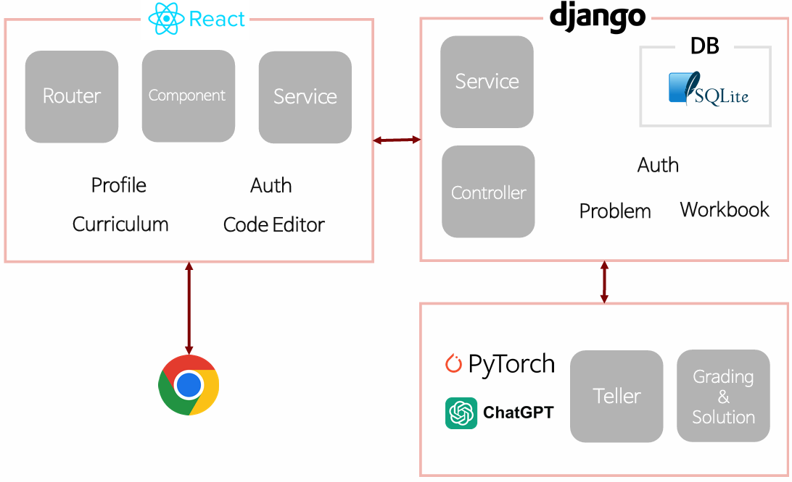

# 📖 CodeTale

        

> Storytelling-based Personalized Learning Platform for Programming Education

CodeTale is an AI-powered educational platform that combines storytelling and programming education to provide a personalized learning experience.

Users select their preferred programming language and storyteller character, then learn coding concepts through an interactive AI-assisted journey.

---

## 🎯 Project Goal

CodeTale was developed to make programming education more engaging and personalized through storytelling and AI technologies.

### Core Ideas

- 📚 Storytelling-based learning experience
- 🤖 AI-powered coding assistance
- 🎯 Personalized curriculum and recommendations
- 💻 Interactive code execution and evaluation

By integrating OpenAI's ChatGPT into the learning process, learners can receive explanations, feedback, and guidance while solving coding problems.

---

## 👥 Team

| Name | Role |
|--------|--------|
| 박성민 | Front-End Development |
| 유현택 | Front-End Development |
| 조성원 | Front-End Development |
| 서보현 | Back-End Development |
| 이재필 | Back-End Development |
| 김민석 | AI Development |
| 채서영 | AI Development |

---

## 🛠 Tech Stack

### Frontend

- React

### Backend

- Django
- SQLite

### AI

- OpenAI ChatGPT
- PyTorch

### Architecture

- Router
- Controller
- Service Layer
- Component-Based UI

---

## 🏗 System Architecture

        

CodeTale은 React 기반 프론트엔드와 Django 백엔드로 구성되어 있으며, 사용자 인증(Auth), 커리큘럼(Curriculum), 문제집(Workbook), 코드 에디터(Code Editor)를 중심으로 동작합니다.
AI 모듈은 ChatGPT를 활용하여 코드 분석, 피드백 제공, 풀이 설명 기능을 수행하며, 사용자의 학습 데이터는 SQLite 데이터베이스에 저장됩니다.

---

## ✨ Key Features

### 📚 Storytelling-Based Learning

- Personalized storyteller selection
- Narrative-driven programming education
- Character-based learning experience

### 📝 Curriculum & Workbook

- Structured learning curriculum
- Weekly chapter progression
- Workbook-based learning materials

### 💻 Online Code Editor

- Browser-based coding environment
- Multiple programming language support
- Code execution and output visualization

### 🤖 AI Coding Assistant

- ChatGPT-powered code analysis
- Automated code explanation
- AI-generated learning feedback

### 👤 Personalized Learning

- User authentication
- Language preferences
- Personalized curriculum experience

---

## 📱 Main Screens

### Home Page

- Project introduction
- Learning journey overview
- Team introduction

### Curriculum

- Weekly learning roadmap
- Chapter-based learning

### Workbook

- Detailed educational materials
- Topic explanations

### Code Editor

- Online code execution
- Coding problem solving
- Real-time output visualization

### AI Feedback

- ChatGPT code review
- Solution analysis
- Learning support

---

## 🚀 What Makes CodeTale Different?

Unlike traditional coding education platforms, CodeTale combines:

- Storytelling-based learning
- Personalized AI tutoring
- Interactive coding practice
- Automated code analysis

This approach transforms programming education from passive content consumption into an engaging, personalized learning experience.

---

## 📅 Development Timeline

| Milestone | Description |
|------------|------------|
| Project Planning | Project kickoff & role assignment |
| Requirement Specification | Requirement analysis |
| Design Specification | System design |
| Implementation | Frontend, Backend, AI development |
| Integration | Component integration |
| Testing | Functional testing |
| Deployment & Review | System deployment and code review |

---

## 🎓 Expected Impact

- Improve learner engagement through storytelling
- Provide personalized programming education
- Reduce learning barriers for beginners
- Utilize AI to deliver immediate feedback
- Create an interactive coding learning environment

---

## 🏆 Academic Project

Developed as Team 6 project for the Software Engineering course at Sungkyunkwan University.
